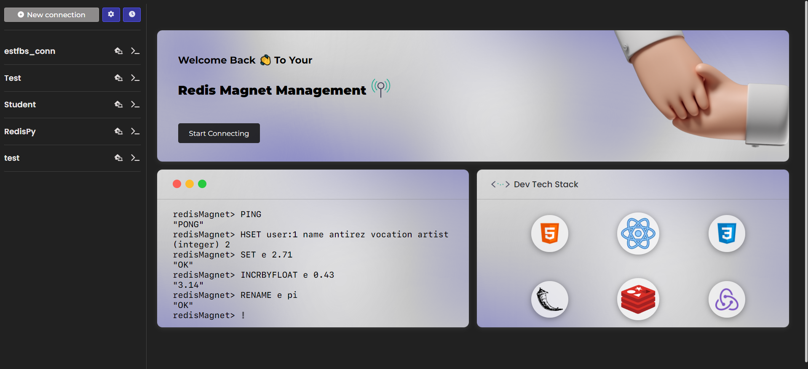
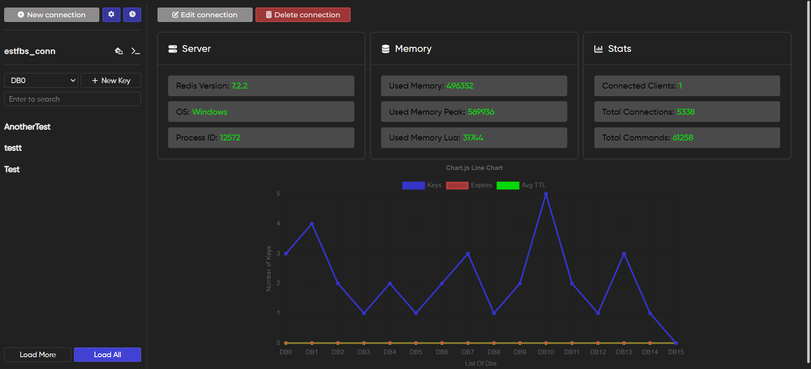

<h2>Redis-manger-web-platform</h2>
Redis, commonly referred to as a "data structure server," is a powerful tool for web developers seeking to optimize data storage and retrieval in their applications. Unlike traditional databases that rely on disk storage, Redis operates entirely in-memory, providing lightning-fast read and write operations. This makes it exceptionally well-suited for web applications where low-latency responses and high-throughput data access are critical.
 
Our Landing Page 🚀 :
 

Some Détails 📊 :
 

